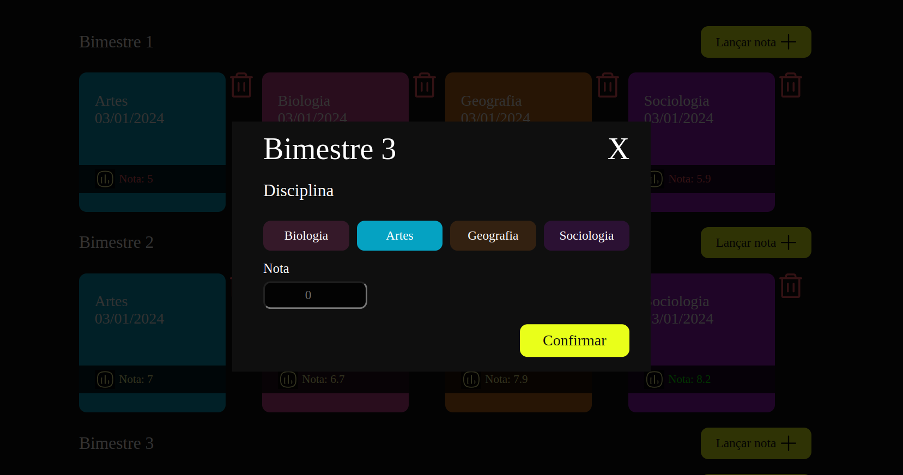

# Linklab Challenge



# Contexto

Projeto de uma aplicação fullstack com api de consulta em banco para inserção, listagem e remoção de notas de um boletim escolar. Banco de dados MongoDb, servidor NodeJs e frontend em React/NextJs.

## Técnologias usadas

Front-end:
> Desenvolvido usando: React, Next, TypeScript, Axios, Eslint, Redux, Redux-Tollkit, SASS

Back-end:
> Desenvolvido usando: NodeJS, ExpressJS, TypeScript, MongoDb, TsNode, Jest, Supertest

## Rodando com Docker

 * Clonando o  repositório:

  ```
  git clone git@github.com:DouglasD18/school-report.git
  cd school-report
  ```

* Rodando docker-compose
  ```
  docker-compose up -d
  ```

## Rodando sem Docker

### Instalando Dependências

> Backend
```bash
cd server/ 
npm install
``` 
> Frontend
```bash
cd client/
npm install
``` 

### Executando aplicação

* Para rodar o backend:

  ```
  cd server/ && npm start
  ```

* Para rodar os testes do backend:

  ```
  cd server/ && npm run test
  ```

* Para rodar o frontend:

  ```
    cd client/ && npm start
  ```

Aplicação rodando na porta http://localhost:3000/
